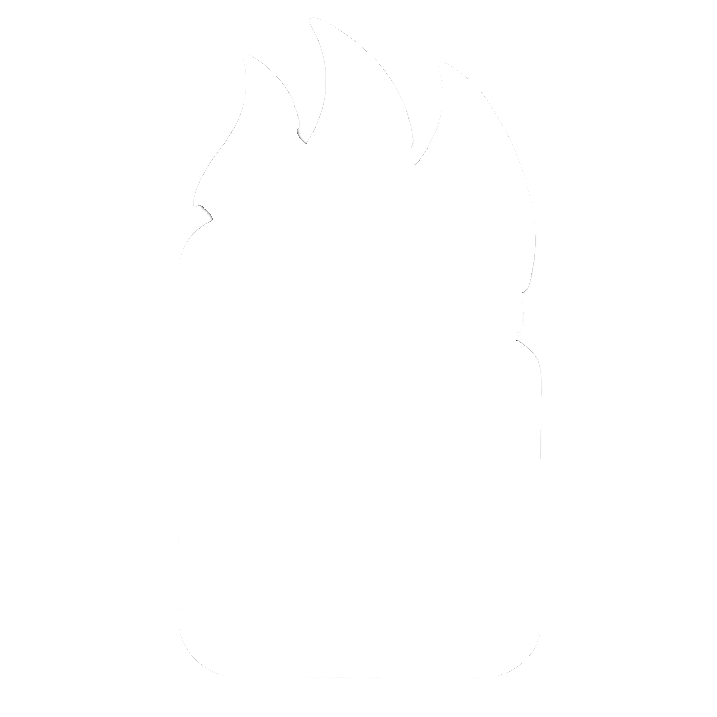

# Flemo

## Overview
This app is designed to help users stay organized by managing tasks, notes, and a photo gallery—all in one place.

## Features

- **Tasks**: Users can create, update, and track tasks to stay on top of their to-do lists.
- **Notes**: A dedicated space for users to store and organize notes for easy reference.
- **Gallery**: Users can upload and view images in a personalized gallery.

## Used Technologies

- Flask
- Jinja 2
- Bootstrap

## Roadmap

- [x] Intuitive UI
- [ ] Tasks
- [ ] Notes
- [ ] Gallery
- [ ] User Authentication
- [ ] Task groups
- [ ] Note folders